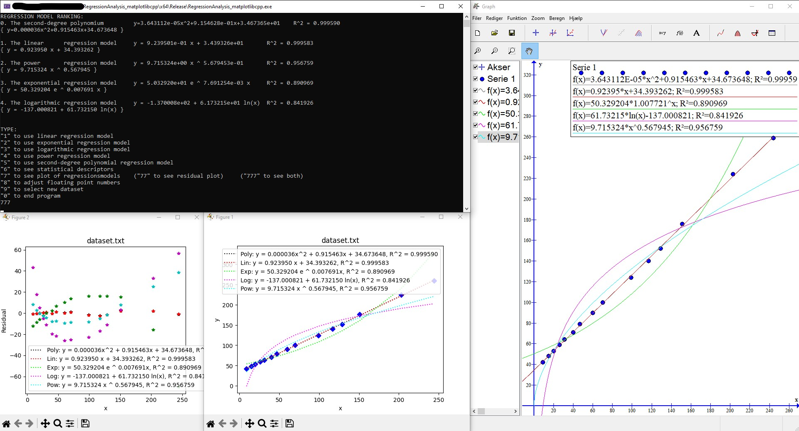
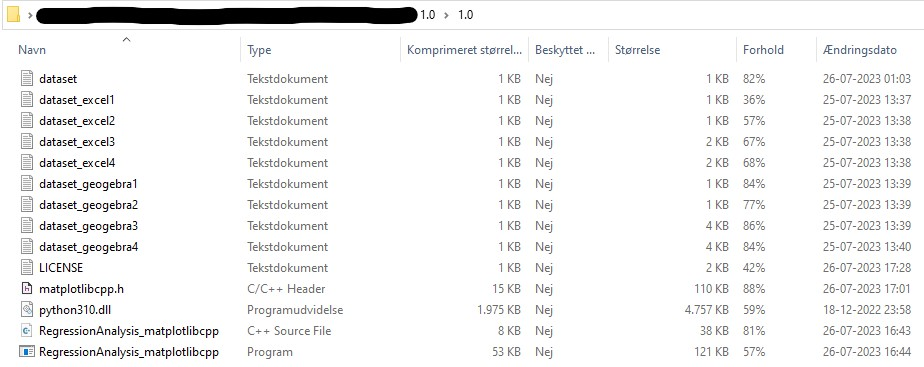

# Imagine regression analysis using Excel, Geogebra, Graph, etc. except it gets done much faster

 

**NOTE: The program Graph is simply used for testing the results of the regression model & coefficient of determination R^2**

## RegressionAnalysis_sciplot
Regression analysis program utilizing sciplot to plot the results. Using .txt files as input, the following can be made:
  - Regression model(s) and coefficient(s) of determination R^2
     1. Linear
     2. Exponential
     3. Logarithmic
     4. Power
     5. Second-degree polynomium [degree of polynomium adjustablue in code]
 - Plotting
    1. Regression models
    2. Residual plot hereof
 - Other statistical descriptors (x- and y-axis respectively
    1. Domain & range; quarters of dataset
    2. Average/mean
    3. Variance, standard deviation, sample standard deviation
 - Correlation coefficient r of ONLY linear regression model

**RegressionAnalysis_sciplot.cpp imports the following files:**
- ...sciplot/sciplot.h
- [FILENAME].txt

 

The format of this [FILENAME].txt can be seen with the available example datasets. Compatible data (in the current state of the program) can be boiled down to the following datapoints:

| **x**  | **y** |
| --- | --- |
| 1  | 1  |
| 1,  | 1  |
| 1.0  | 1.0  |
| 1.0,  | 1.0  |
| 1,0  | 1,0  |
| 1,0,  | 1,0  |

*NOTE: Do not forget to enter SPACEBAR or TAB in between the x- and y-axis for each line in [FILENAME].txt* 
## PRO TIP regarding datasets from excel, geogebra, graph, etc
1. DATASET -> CTRL + C
2. REPOSITORY -> Make/insert .txt file
3. .txt file -> CTRL + V

You're welcome
## How to import sciplot to you project:
1. Install gnuplot: https://sourceforge.net/projects/gnuplot/
   - Make sure to set {...\gnuplot\bin} as an environment variabel
2. Install sciplot https://github.com/sciplot/sciplot

At this point, [...]

3. include the following under "include Directories": {...\sciplot}

After that, you should be good to run the .cpp file
