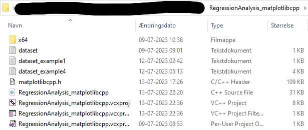

# RegressionAnalysis_matplotlibcpp
Regression analysis tool (class regression) utilizing matplotlibcpp.h to graph the results.
Using .txt files as input, the following can be made:
  - Regression models
     1. Linear (2-part linear is an option)
     2. Exponential
     3. Logarithmic
     4. Power
     5. Second-degree polynomium [degree of polynomium adjustablue in code]
 - Correlation coefficient(s) hereof [R^2]
 - Graph of regression models
 - Other statistical descriptors [MORE PENDING]

**PENDING:**
1. Get scientific values of "inprecise" fixed values
2. Get additional statistical descriptors

**RegressionAnalysis_matplotlibcpp.cpp imports the following files:**
- matplotlibcpp.h
- [FILENAME].txt

The imported files were in my instance put under the same repository as the .cpp program.

 

The format of this [FILENAME].txt can be seen with the available example datasets. Compatible data (in the current state of the program) can be boiled down to the following datapoints:

| **x**  | **y** |
| --- | --- |
| 1  | 1  |
| 1,  | 1  |
| 1.0  | 1.0  |
| 1.0,  | 1.0  |
| 1,0  | 1,0  |
| 1,0,  | 1,0  |

*NOTE: Do not forget to enter SPACEBAR or TAB in between the x- and y-axis for each line in [FILENAME].txt* 

## How to import matplotlibcpp.h
This link should do the trick: https://stackoverflow.com/questions/66507618/running-python-matplotlibcpp-in-visual-studio-2019

To sum up the proces of importing matplotlibcpp, here is a checklist:
1. Open command prompt. Check if python is installed (python versions 3.7 - 3.9 are recommended. Newer versions of python will cause unwanted errors) by entering the first of the following commands:
   - python --version
   - python -m pip install matplotlib
   - python -m pip install numpy
2. Create project (I used visual studio 2022)
3. Download matplotlibcpp.h: https://github.com/lava/matplotlib-cpp/blob/60dcd64c8fd4766e5426f57decfb765422a1d3fe/matplotlibcpp.h#L303
   - SANITY CHECK: Make sure to get rid of  ll. 351-356 inside of matplotlibcpp.h 
4. Move matplotlibcpp.h to project repository. Alternatively include header file via solutions explorer [SHIFT+ALT+L]
5. From the used python repository, include the following under "include Directories":
	- ...\Python37\include
	- ...Python37\Lib\site-packages\numpy\core\include
6. From the used python repository, include the following under "Library Directories":
	- ...\Python37\libs
7. Don't forget to set Solution Configurations to RELEASE
